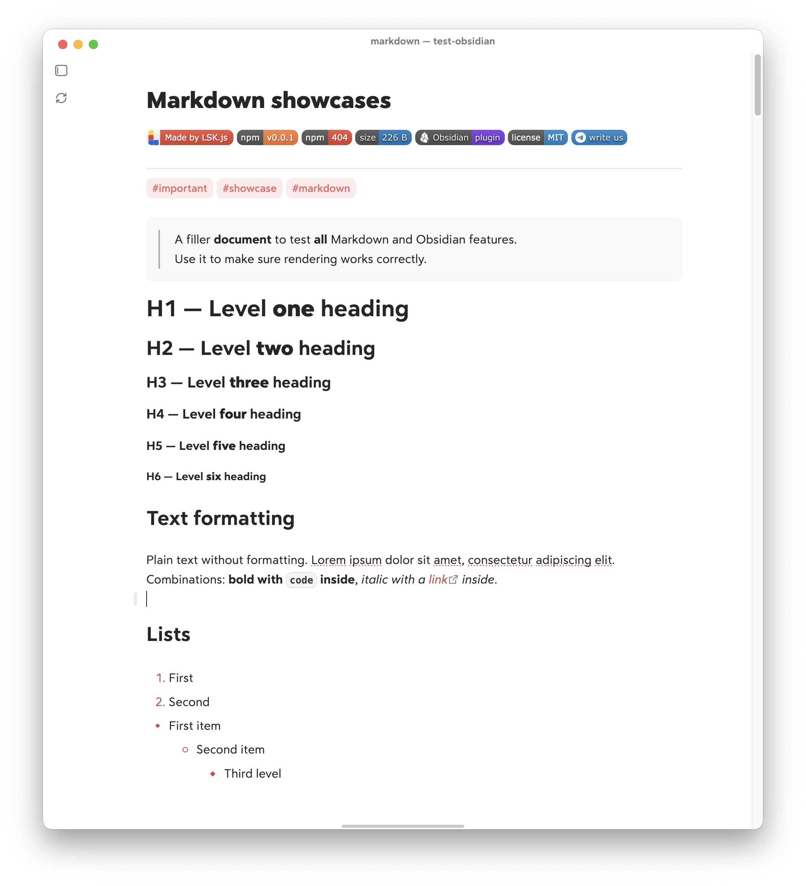

# 🐻‍❄️ Zen Mode for Obsidian

<p>
  <a href="https://github.com/lskjs"></a>
  <a href="https://www.npmjs.com/package/obsidian-zen"></a>
  <a href="https://www.npmjs.com/package/obsidian-zen"></a>
  <a href="https://www.npmjs.com/package/obsidian-zen"></a>
  <a href="https://obsidian.md"></a>
  <a href="https://github.com/isuvorov/obsidian-zen/blob/main/LICENSE"></a>
  <a href="https://t.me/isuvorov"></a>
</p>


<div align="center">
  <h3><p><strong>🐻‍❄️ Zen Mode plugin for Obsidian 🐻‍❄️</strong></p></h3>
</div>

**🧘 Zen mode** — no header, no tabs, no noise — focus on content <br/>
**🎨 Accent** — accent only important, powered by Cupertino <br/>
**⌨️ Hotkeys** — familiar hotkeys from other editors like Bear App <br/>
**⚡ Sync** — keeps any vault in sync with your own setting <br/>
**📂 File** — open any file without adding a vault <br/>

<div align="center">
  
</div>

---

## Quick Start

Have an Obsidian vault? Roll out the plugin and settings with one command:

```bash
npx obsidian-zen sync ~/vaults/work
```

Reload the Obsidian app if needed, then press `Cmd + §` / `Cmd + ~` or Swipe. Enjoy the silence.

---

## Install via CLI

The CLI installs the plugin straight from the repo and applies the `settings/`
profile into a vault. It's **non-destructive** — it backs up `.obsidian/` first,
deep-merges JSON (your own keys are kept) and never deletes anything.

```bash
npx obsidian-zen sync ~/vaults/work             # roll out
npx obsidian-zen sync ~/vaults/work --dry-run   # preview the plan, change nothing
```

After it finishes, press `Cmd+R` in the vault and enable the **Zen Mode** plugin.

## Install via BRAT

Prefer the in-app route? Install with [**BRAT**](https://github.com/TfTHacker/obsidian42-brat):

1. Install and enable **BRAT** (Settings → Community plugins).
2. Command palette → **BRAT: Add a beta plugin** → paste `https://github.com/isuvorov/obsidian-zen`.
3. Enable **Zen Mode** (Settings → Community plugins).

---

## CLI

Two subcommands, both run on Node and Bun.

### `sync` — roll out the plugin and settings into a vault

```bash
npx obsidian-zen sync ~/vaults/work               # default source (this GitHub repo)
npx obsidian-zen sync ~/vaults/work --dry-run     # show the plan without changes
npx obsidian-zen sync ~/vaults/work --from .      # from a local clone (development)
npx obsidian-zen sync ~/vaults/work --from you/fork   # from another owner/repo
```

| Argument    | Alias | Default                                    | Purpose                                           |
|-------------|-------|--------------------------------------------|---------------------------------------------------|
| `<vault>`   | —     | (required)                                 | path to the target Obsidian vault                 |
| `--from`    | `-f`  | `https://github.com/isuvorov/obsidian-zen` | profile source: folder \| git URL \| `owner/repo` |
| `--dry-run` | `-n`  | `false`                                    | show the plan without changes                     |

### `open` — open a file or a whole vault in Obsidian

Open a `.md` file that lives **anywhere** on disk, even outside a vault. Local
attachments the note links to are symlinked alongside it, so images render.
Pass a **vault folder** (one containing `.obsidian`) and that vault is opened
directly — so `open .` inside a vault just opens it. A non-vault folder with a
`README.md` opens that README instead.

```bash
npx obsidian-zen open README.md                       # open in the active vault
npx obsidian-zen open .                                # open the vault in the current folder
npx obsidian-zen open ~/projects/app/docs/*.md         # several files at once
npx obsidian-zen open NOTES.md --vault ~/vaults/work   # pick the destination vault
npx obsidian-zen open paper.md --mirror ~/projects/app # mirror the tree under the vault
```

| Argument    | Alias | Default      | Purpose                                                                 |
|-------------|-------|--------------|-------------------------------------------------------------------------|
| `<files..>` | —     | (required)   | one or more `.md` files, or a vault folder to open the vault itself     |
| `--vault`   | `-V`  | active vault | destination vault for the symlinks                                      |
| `--mirror`  | `-m`  | —            | directory whose inner structure is mirrored into the vault (repeatable) |

#### `ob` — global shortcut

Install once, alias it, and opening a note is two letters:

```bash
npm i -g obsidian-zen
alias ob='obsidian-zen open'    # add to ~/.zshrc to keep it

ob note.md                      # open a single file
ob ~/projects/app/docs/*.md     # a whole folder at once (shell glob)
ob .                            # open the current vault
```

> A bare directory opens as a vault if it has `.obsidian`, else its `README.md`
> if present; otherwise pass `.md` files or a glob like `docs/*.md`.

---

## Hotkeys & commands

The `settings/hotkeys.json` profile binds keys to plugin and core commands:

| Hotkey            | Action                                                 |
| ----------------- | ------------------------------------------------------ |
| `Cmd+1` … `Cmd+6` | Toggle heading 1–6 (toggle: pressing again removes it) |
| `Cmd+0`           | Remove heading (plain text)                            |
| `Cmd+P`           | Quick switcher (open file)                             |
| `Cmd+Shift+P`     | Command palette                                        |
| `Cmd+Ctrl+P`      | Open another vault (in-window fuzzy palette)           |
| `Cmd+§` / `Cmd+~` / 2-finger swipe | Toggle the left sidebar (swipe: → reveal, ← hide)     |
| `Cmd+Shift+§` / `Cmd+Shift+~`      | Toggle the right sidebar                              |

> Collapse **both** sidebars → **zen mode** kicks in: the view header, tab bar
> and inline title hide, and the titlebar is painted to match the background.


### Enter in Zen Mode

Zen mode strips the editor down to your content — the view header, tab bar and
inline title disappear, and the titlebar blends into the background. Nothing but
the words on the page, so you can write or read without the UI tugging at your
attention. It kicks in the moment **both** sidebars are collapsed.

Get there two ways. By **hotkey** — `Cmd+§` toggles the left sidebar and
`Cmd+Shift+§` the right; collapse both and you're in. Or by **swipe** — a
two-finger trackpad swipe toggles the left sidebar, the way it works on iPad /
in Things 3: **swipe right to reveal, swipe left to hide**.

---

## License

MIT — see [LICENSE](LICENSE).
