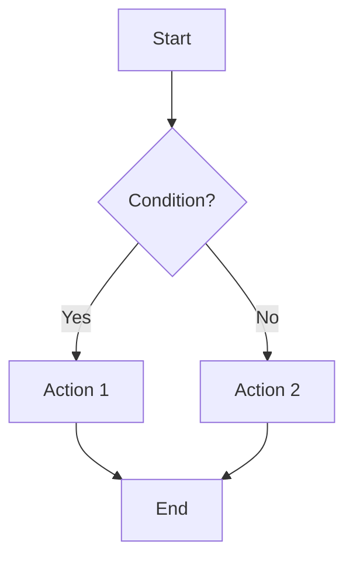
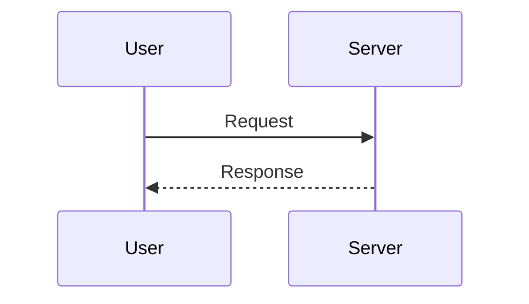
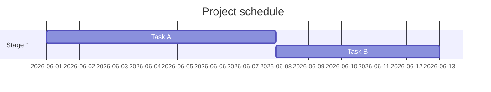

# **Markdown showcases**
<p>
  <a href="https://github.com/lskjs"></a>
  <a href="https://www.npmjs.com/package/obsidian-zen"></a>
  <a href="https://www.npmjs.com/package/obsidian-zen"></a>
  <a href="https://www.npmjs.com/package/obsidian-zen"></a>
  <a href="https://obsidian.md"></a>
  <a href="https://github.com/isuvorov/obsidian-zen/blob/main/LICENSE"></a>
  <a href="https://t.me/isuvorov"></a>
</p>
-------------
#important #showcase #markdown 

> A filler **document** to test **all** Markdown and Obsidian features.
> Use it to make sure rendering works correctly.
# H1 — Level **one** heading
## H2 — Level **two** heading
### H3 — Level **three** heading
#### H4 — Level **four** heading
##### H5 — Level **five** heading
###### H6 — Level **six** heading

## Text formatting

Plain text without formatting. Lorem ipsum dolor sit amet, consectetur adipiscing elit.
Combinations: **bold with `code` inside**, *italic with a [link](https://obsidian.md) inside*.

## Lists

1. First
2. Second
- First item
	- Second item
	    - Third level


---

## Blockquotes

> This is a simple blockquote.

> A blockquote with multiple paragraphs.
>
> Second paragraph inside the blockquote.

> Nested blockquotes:
>> Second level
>>> Third level

> A blockquote with **formatting**, `code`, and a [link](https://example.com).
>
> > — Quote author

---


### Numbered list

1. First
2. Second
   1. Nested 2.1
   2. Nested 2.2
3. Third
1. Numbering can start at any value
8. …and numbers don't have to be in order

### Task list (checkboxes)

- [x] Completed task
- [ ] Incomplete task
- [ ] Task with **formatting** and a [link](#)
  - [x] Nested completed
  - [ ] Nested incomplete
- [/] In progress (Obsidian extended statuses)
- [-] Cancelled
- [?] In question
- [!] Important

### Definition list

Term 1
: Definition of term 1

Term 2
: First definition
: Second definition

### Simple table

| Column A | Column B | Column C |
| -------- | -------- | -------- |
| 1        | 2        | 3        |
| 4        | 5        | 6        |

---

## Links and anchors

- Plain link: [Obsidian](https://obsidian.md)
- Link with a hover title: [Google](https://google.com "Google search engine")
- Autolink: <https://www.example.com>
- Email: <hello@example.com>
- Link to a heading within the document: [Go to tables](#Tables)
- Reference-style link: [link text][ref-id]

[ref-id]: https://obsidian.md "Reference-style link"

### Obsidian Wiki links

- Internal link: [[index doc]]
- Link with an alias: [[index doc|readable text]]
- Link to a heading: [[markdown-showcase#Headings]]
- Link to a block: [[markdown-showcase#^block-id]]
- Link to a non-existent note: [[Non-existent note]]

This paragraph has a block identifier for linking. ^block-id

---

## Images

### Markdown syntax


### Obsidian embed

- Embedding an image: `![[image.png]]`
- With a specified width: `![[image.png|200]]`
- Embedding an entire other note: `![[index doc]]`
- Embedding a heading from a note: `![[markdown-showcase#Lists]]`
- Embedding a block: `![[markdown-showcase#^block-id]]`
- Embedding a PDF page: `![[document.pdf#page=3]]`

---

## Code

### Inline code

Use `const x = 42;` within text or `npm install`.

### Code block without highlighting

```
Just text
without syntax highlighting
  preserving   indentation
```

### JavaScript

```js
function greet(name) {
  const message = `Hello, ${name}!`;
  console.log(message);
  return message;
}

greet("world");
```

### Python

```python
def fibonacci(n: int) -> list[int]:
    """Returns the first n Fibonacci numbers."""
    seq = [0, 1]
    while len(seq) < n:
        seq.append(seq[-1] + seq[-2])
    return seq[:n]

print(fibonacci(10))
```

### TypeScript

```typescript
interface User {
  id: number;
  name: string;
  email?: string;
}

const user: User = { id: 1, name: "Anna" };
```

### Bash

```bash
#!/usr/bin/env bash
set -euo pipefail
for f in *.md; do
  echo "Processing: $f"
done
```

### JSON

```json
{
  "name": "test-obsidian",
  "version": "1.0.0",
  "tags": ["demo", "markdown"],
  "nested": { "key": "value" }
}
```

### Diff

```diff
- old line
+ new line
  unchanged
```

---

## Tables

### With alignment

| Left-aligned | Centered   | Right-aligned   |     |     |     |
| :----------- | :--------: | --------------: | --- | --- | --- |
| left         |   center   |           right |     |     |     |
| text         |    text    |            text |     |     |     |
| `code`       |  **bold**  |        *italic* |     |     |     |
|              |            |                 |     |     |     |
|              |            |                 |     |     |     |

### With formatting in cells

| Feature | Support | Example                  |
| ------- | :-----: | ------------------------ |
| Links   |    ✅     | [link](https://test.com) |
| Code    |    ✅     | `inline`                 |
| Emoji   |    ✅     | 🎉 🚀 ⭐                  |
|         |         |                          |
|         |         |                          |
|         |         |                          |
|         |         |                          |

---

## Callouts (Obsidian)

> [!note]
> This is a **note** callout. It supports normal formatting.

> [!info] Info title
> An information block with a custom title.

> [!tip] Tip
> A useful tip for the user.

> [!success] Done
> The operation completed successfully.

> [!question] Question
> What if…?

> [!warning] Warning
> Be careful with this action.

> [!failure] Failure
> Something went wrong.

> [!danger] Danger
> A critical warning.

> [!bug] Bug
> A known issue.

> [!example] Example
> A demonstration by example.

> [!quote] Quote
> Wise words.

> [!abstract]+ Expanded by default (foldable)
> This callout can be collapsed, and it is expanded initially (the `+` sign).

> [!todo]- Collapsed by default (foldable)
> This callout is collapsed initially (the `-` sign). Click to expand.

> [!note] Nested callouts
> > [!tip] Nested tip
> > Callouts can be nested inside one another.

---

## Formulas (LaTeX / MathJax)

### Inline formula

The area of a circle is $S = \pi r^2$, and the Pythagorean theorem: $a^2 + b^2 = c^2$.

### Block formula

$$
\int_{-\infty}^{\infty} e^{-x^2} \, dx = \sqrt{\pi}
$$

$$
\begin{aligned}
f(x) &= (x + 1)^2 \\
     &= x^2 + 2x + 1
\end{aligned}
$$

Matrix:

$$
A = \begin{pmatrix}
a & b \\
c & d
\end{pmatrix}
$$

Series sum: $\displaystyle \sum_{n=1}^{\infty} \frac{1}{n^2} = \frac{\pi^2}{6}$

---

## Diagrams (Mermaid)

### Flowchart



### Sequence diagram



### Gantt



---

## Horizontal rules

Three ways to create a line:

---

***

___

---

## HTML embeds

<div align="center">
  <strong>Centered text via HTML</strong>
</div>

<details>
<summary>Collapsible block (click)</summary>

Hidden content that appears when expanded.
It supports **markdown** inside.

</details>

<br>

Text color via HTML: <span style="color: red;">red</span>, <span style="color: green;">green</span>, <span style="color: blue;">blue</span>.

---

## Footnotes

This sentence has a footnote.[^1] And here is another footnote.[^note]

You can also use inline footnotes.^[This is an inline footnote right in the text.]

[^1]: Text of the first footnote.
[^note]: Text of the named footnote with **formatting** and a [link](https://obsidian.md).

---

## Tags (Obsidian)

Tags in text: #demo #markdown/overview #project/important #2026

Nested tags use a slash: #parent/child/grandchild

---

## Escaping characters

To show characters literally, escape them with a backslash:

\*not italic\* · \`not code\` · \# not a heading · \[not a link\] · \> not a quote

Literals: \\ \* \_ \{ \} \[ \] \( \) \# \+ \- \. \! \|

---

## Special characters and emoji

- Arrows: → ← ↑ ↓ ↔ ⇒ ⇐
- Math: ± × ÷ ≠ ≈ ≤ ≥ ∞ ∑ ∏ √
- Currency: $ € £ ¥ ₽ ¢
- Typography: © ® ™ § ¶ † ‡ • …
- Quotes: «guillemets» „low-high" 'English'
- Emoji: 😀 🎉 🚀 ⭐ ✅ ❌ ⚠️ 💡 🔥 📌 🧪

---

## Comments (Obsidian)

%%
This is an Obsidian comment. It is not shown in reading mode,
but it is visible in editing mode.
%%

Text before %%inline comment%% and after it.

---

## Nested combination of everything

> [!example] Complex example
> 1. Item with **bold** and `code`
> 2. Item with a link [[index doc]]
>    - [ ] Subtask with a formula $x^2$
>    - [x] Completed subtask
> 
> | A | B |
> | - | - |
> | 1 | 2 |
>
> ```js
> console.log("code inside a callout");
> ```

---

*End of document.* If everything above renders correctly — the Markdown rendering is fine. ✅
